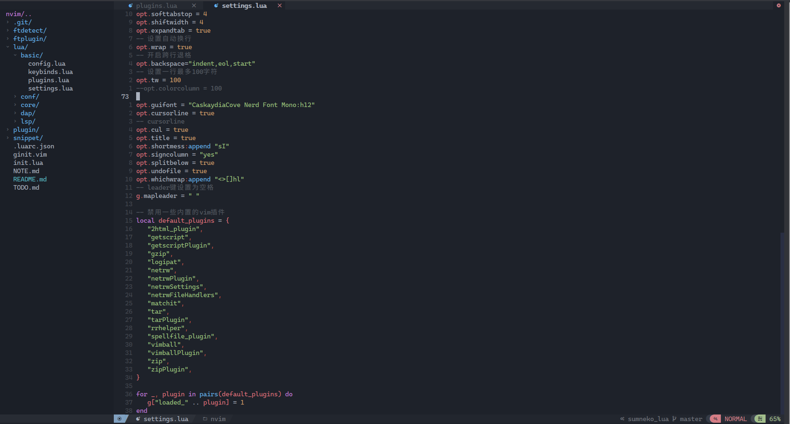
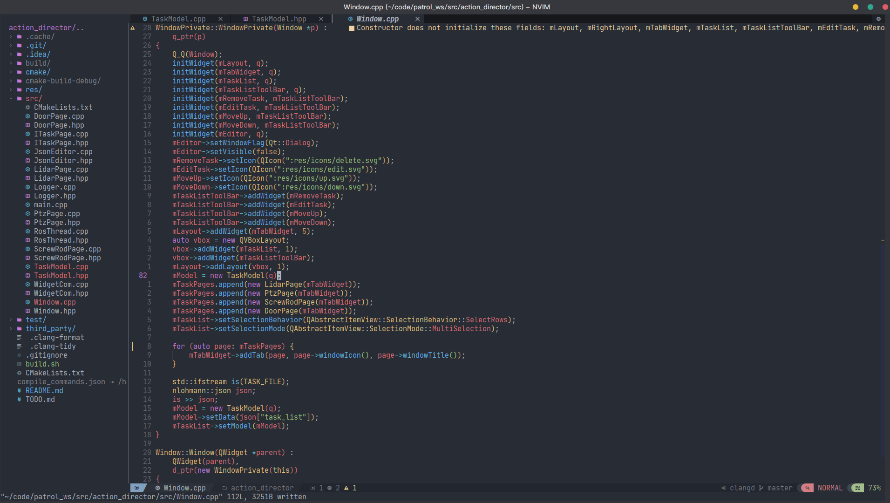

## Intro

This is my NeoVim config (for version 0.7 and greater).

## Features

- beautiful theme
- lsp support
- convenient keymaps

## Install

- clone this to .config/nvim
- exec `:PackerSync`
- install treesitter language support by `:TSInstall cpp`
- install lspserver by `LspInstall clangd`
- download plugin dependency, like `rg` and `fd` for file grep and live grep in `telescope.nvim`
- if `base46` not found in `.local/share/nvim/site/pack/packer/opt`, create soft symbol link to `base46` in `.local/share/nvim/site/pack/packer/start`

## Todos

- [x] cmake indent width: modify cmake format python script
- [x] clang-format test
- [ ] c++ generate code, e.g. some clion features
- [ ] load configure from local project like `.vim` dir or something
- [ ] ros message file format highlight
- [ ] git sign show diff code like vscode
- [ ] ros `.launch` file parse as xml format
- [ ] ros `.msg`,`.action`,`.srv` files highlighter
- [ ] multi-line edit

## Thanks

- nvchad
- [askfiy](https://www.zhihu.com/people/cui-qin-3)'s posts

